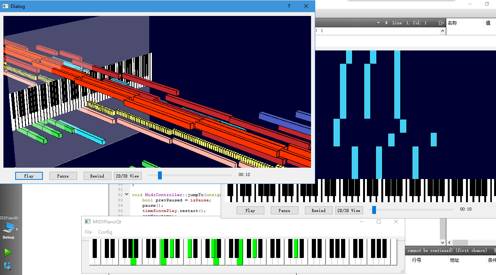

# MidiPianoQt
A midi player & visualizer made by Qt5 with basic openGL.

## demo

## Structure of classes

- OpenGLWidget: implement some painter of shapes like quads, rects, etc.
- MidiOpenGLWidget: use OpenGLWidget to visualize the midi files
- MidiIOManager: to handle the I/O events of midi devices
- MidiController: the logic of midi player
- MidiFileReader: to parse the raw binary midi files, including data structures of parsed midi files